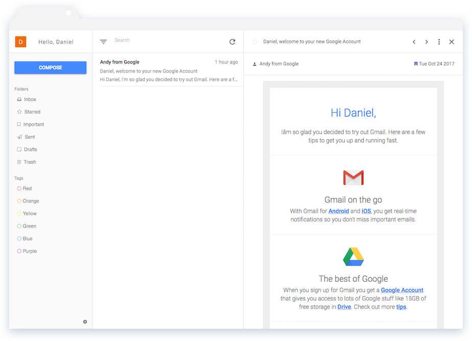

# Welcome Mail

## Description
Welcome Mail is a webmail application focused on bringing a simplified user experience back to email.

## Installation
This application is a demo that installs with [Webstack](https://github.com/danrpts/webstack), a boilerplate project for building JavaScript single page applications with Gulp, Express, and Backbone. To install Welcome Mail we must simply clone and install Webstack:

    git clone https://github.com/danrpts/webstack.git
    cd webstack
    npm install -g gulp express
    npm install

## Configuration
This web application consumes [RFC 2822](https://tools.ietf.org/html/rfc2822) messages served from a REST API and authenticates with OAuth 2.0, by default it uses [GMail's REST API](https://developers.google.com/gmail/api/v1/reference/) and [Google's OAuth 2.0 Client Side Flow](https://developers.google.com/identity/protocols/OAuth2UserAgent). When authenticating with Google OAuth 2.0 you must update the `client_id` and `client_secret` [credentials](https://developers.google.com/identity/protocols/OAuth2UserAgent#creatingcred) found in the following files:
 - webstack/webserver/config/google_config.json and
 - webstack/webclient/webmail/javascripts/config/google.json

## Usage
To start the Welcome Mail application we simply run two scripts from our root webstack/ directory. We first tell Gulp to build the project, and then run our npm script to start serving it. By default, the application will be served at [http://localhost:3000](http://localhost:3000).

    gulp --build webmail
    npm start

## Contributing
Please submit issues and pull request to the [Webstack](https://github.com/danrpts/webstack) repository!

## Credits
Daniel Peterson <danrpts@gmail.com>

## License
GPL-3.0
